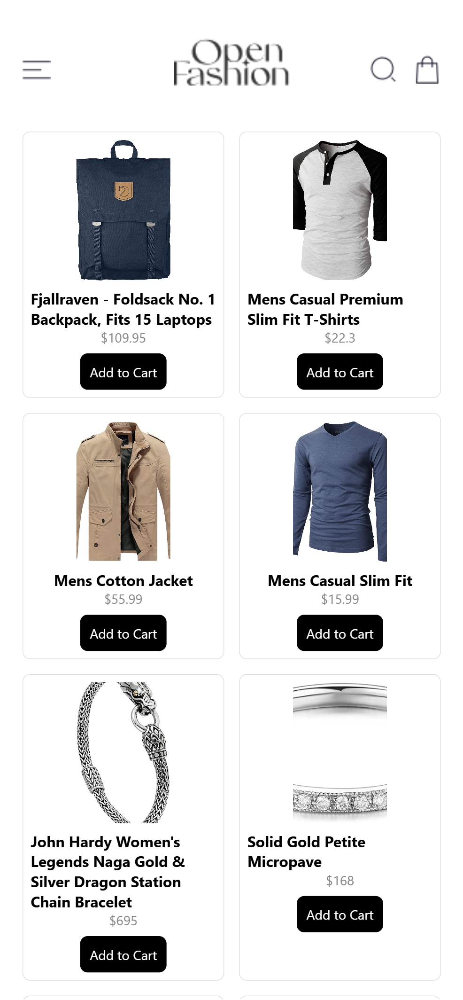
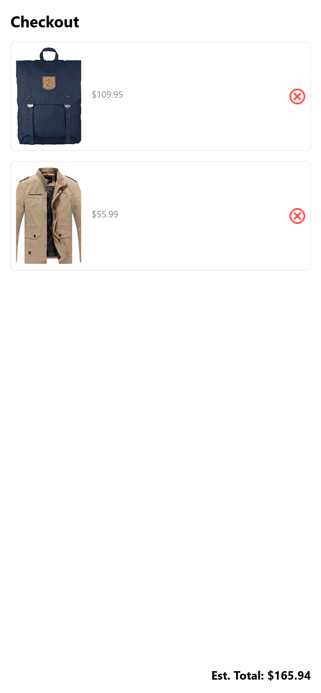
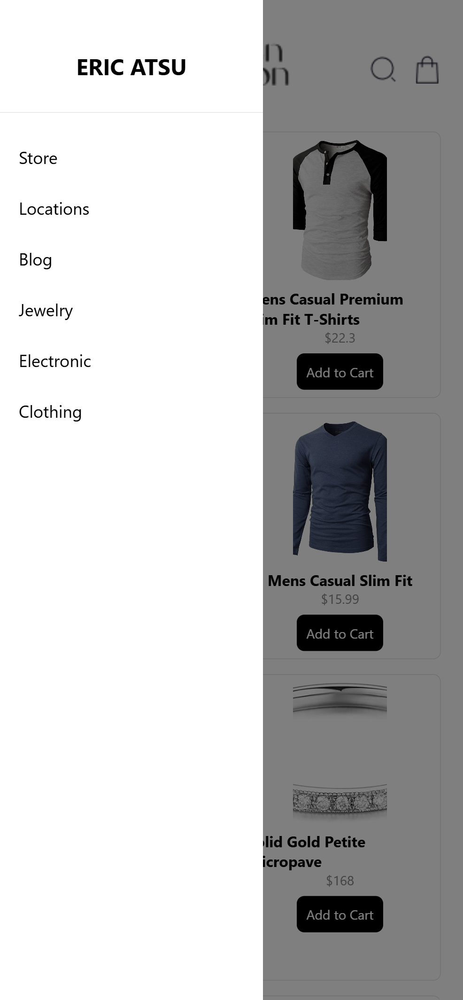

# React Native Shopping App

## Introduction
This app demonstrates a simple shopping interface with a list of products fetched from an external API. Users can view product details, add products to a cart, and view/remove items from the cart. The app uses local storage to persist cart items.

## Design Choices
- **UI Consistency**: Ensured a uniform design for a better user experience.
- **Local Storage**: Used AsyncStorage for simplicity and efficiency in storing cart items.
- **Reusable Components**: Created reusable components to maintain clean and manageable code.

## Data Storage
The cart items are stored locally using AsyncStorage. When items are added or removed from the cart, the local storage is updated accordingly.

## Screenshots
- HomeScreen: 
  

- ProductDetailScreen: 

- CartScreen: 

- Drawer Menu: 

